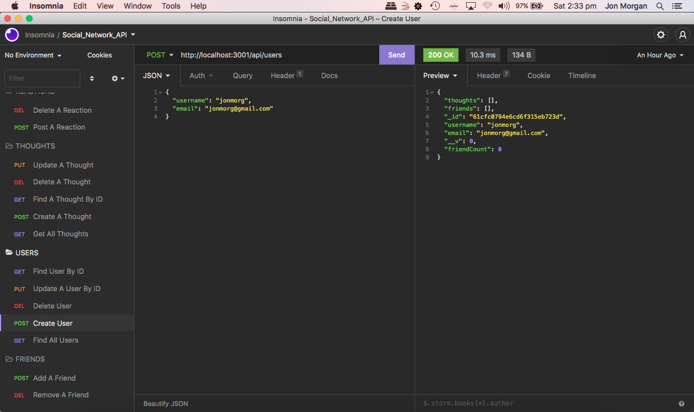

# SOCIAL NETWORK API

# Table of Contents

- [Description](#description)
- [Screenshot](#screenshot)
- [Demo](*demo)
- [Installation](#installation)
- [Usage](#usage)
- [License](#license)

# Description

This is a noSQL database using MongoDB that allows for API endpoints to interact with the database. Since this database is designed for a social networking platform, the database contains API endpoints for Users, their thoughts, and their friends' reactions to those thoughts.

# Screenshot

# Demo

# Installation

Install nodejs and dependencies (npm inquirer) the download code

# Usage

Using nodejs, run node server.js and use Insomnia to replicate the requests as per the demo video

# License

MIT
